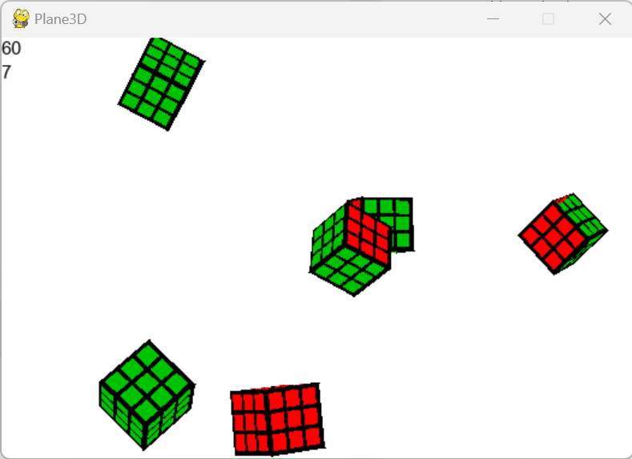

Graphix Plane3D is a simple 3d renderer with texturing, 
rotation, and transformation. Large textures slow it down.
To add objects, open Objects.py, copy class Cube, and edit 
the vertices (X,Y,Z,R,G,B,x,y,z,tex,o,xr,yr,zr), where X, Y, Z 
is the permanant pos, R, G, B is the colour (not required),
x,y,z is the tranformation, tex is the image file(or name of texture)
o is the orientation of the texture, and xr,yr,zr are the rotations 
around the axis.
With the demo file, click and drag to rotate the veiw, 
right click to add a cube, middle click to add a tank, 
and look at the code to find all the other controls.
alphazero is a transparent image that all other images are
rendered on, so if you change the window size, change the 
size of alphazero to match, to optimize performance.
If you are rendering on only one part of the window
(leaving room for a 2d interface), match 
alphazero to the size of that area for best performance.
Scene.py contains functions to use to run external programs.

Based on https://github.com/Jasonfran/3D-rendering-in-pygame
# 3D-rendering-in-pygame
A 3D renderer with Pygame in order to help myself learn the maths properly. I found out that I was lacking in the maths behind 3D rendering a bit, or moreso that I couldn't think it on the spot. So this properly gave me the understanding of going from object space vertices to screen space pixels.
The process is supposed to be similar to OpenGL since that's what I'm learning. The only thing it doesn't do is rasterize, it uses Pygame triangles instead.
Also there is a small glitch where 2 triangles aren't properly rendered in front like they should be.

